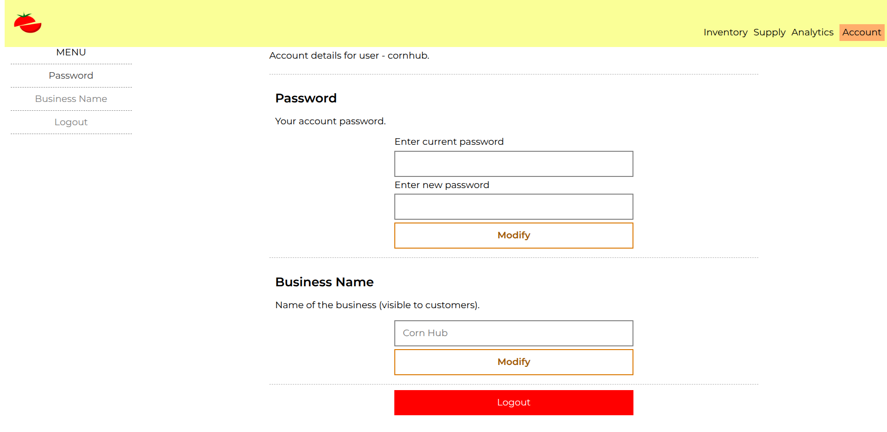
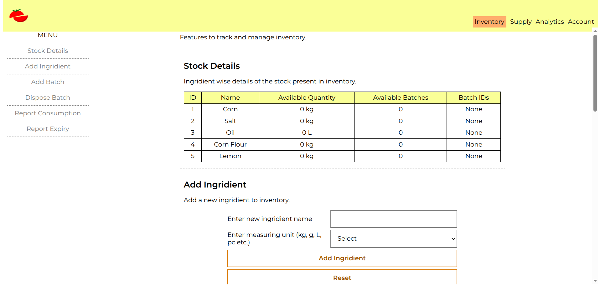
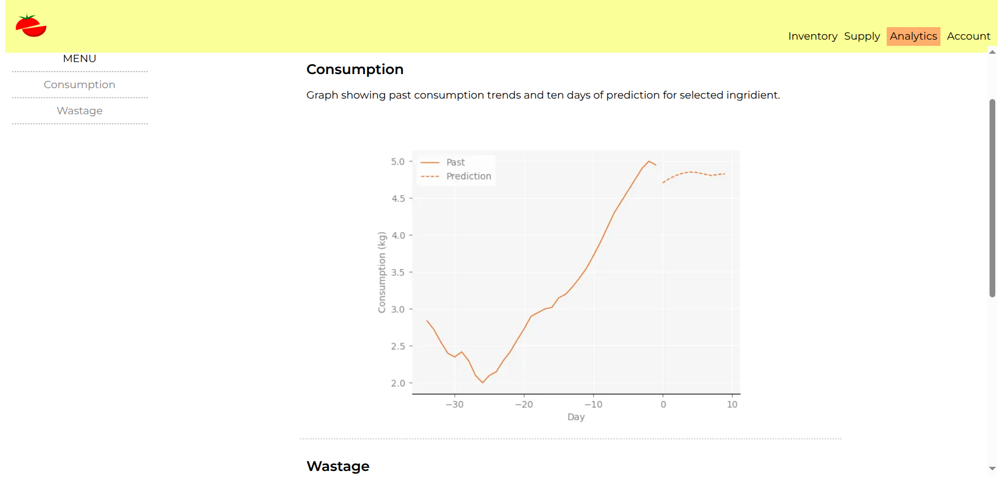

# Kitchen Inventory

A software solution for small and
medium businesses to help manage
their kitchen inventory.

**! Work in Progress !**

## Application & Purpose
Features and basic description.

## Logical Architecture

Details of how it is intended to work.
Relationship among tables, etc.

## Technical Architectecture

In short, this is a multipage web application.
It is served using the Python Flask web framework over https.
HTML documents styled with CSS are used for user interaction
on the browser. SQLite is used for the database.

## Roadmap

Roadmap of main goals -

- [x] Complete main features.
- [x] Complete analytics.
- [ ] Complete basic css file organisation \
  and sanitation if required.
- [ ] Test
- [ ] Document (technical and non technical details
  in README file).

Roadmap of future/uncertain goals -

- Implement responsive layout to allow
  proper working on mobile devices too.
- Implement unit testing.
- Add filters in tables
    (for ordering rows based on different columns).
- Dynamic form validation to improve UX.

## Rough instructions for hosting the project publicly
- Initialise the database with `commands/init_database`.
- Change the secret key in `kinventory/__init__.py` for security.

To pull the changes in your server using git -
1. Run `git stash` to remove the changes you made to the server (like the secret key).
2. Run `git pull` to pull the changes from the github repository.
3. Restart your server to reflect the latest file changes.
(tested on pythonanywhere)