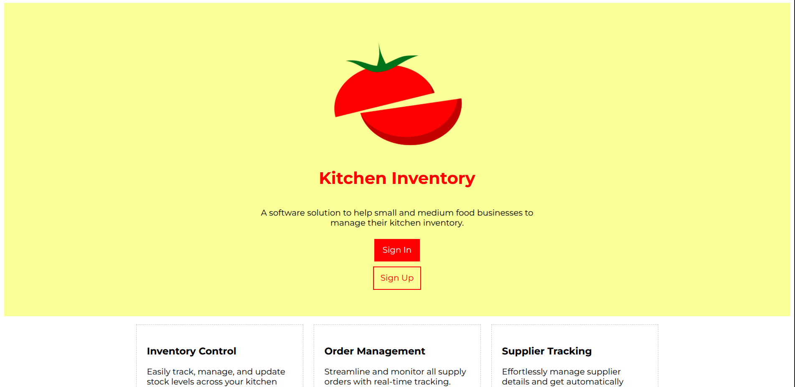

# Kitchen Inventory

A software solution for small and
medium businesses to help manage
their kitchen inventory.

**! Work in Progress !**

## Roadmap

Roadmap of main goals -

- [x] Complete main features.
- [x] Complete analytics.
- [ ] Complete basic css file organisation \
  and sanitation if required.
- [ ] Test
- [ ] Document (technical and non technical details
  in README file).

Roadmap of future/uncertain goals -

- Implement responsive layout to allow
  proper working on mobile devices too.
- Implement unit testing.
- Add filters in tables
    (for ordering rows based on different columns).
- Dynamic form validation to improve UX.